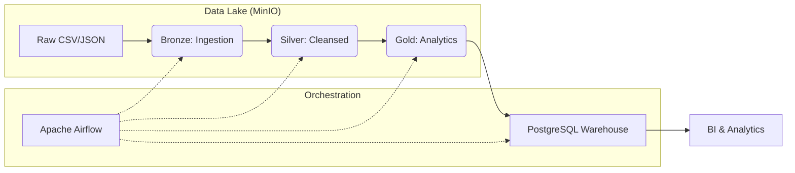

# 🚀 E-commerce Medallion Data Pipeline

Welcome to the **Medallion Architect Challenge Project**! This project implements a modern data engineering pipeline using the **Medallion Architecture** to process the [Brazilian E-commerce Public Dataset by Olist](https://www.kaggle.com/datasets/olistbr/brazilian-ecommerce). It transforms raw datasets into a high-performance, analytics-ready Data Warehouse.

---

## 🏗️ Architecture Overview

The pipeline follows the **Medallion Architecture** pattern, ensuring data quality and lineage at every stage:



### 🛰️ The Three Layers:
1.  **🥉 Bronze (Raw)**: Captures the original data from source files "as-is" into MinIO.
2.  **🥈 Silver (Cleansed)**: Deduplication, null handling, data typing, and schema validation.
3.  **🥇 Gold (Curated)**: Business-level aggregates, Star Schema (Facts & Dimensions), and Feature Tables for ML.

---

## 📊 Data Schema

The project implements a Star Schema in the Gold layer, optimized for analytical queries.


*Note: The schema includes core dimensions (Customers, Products, Sellers, Location, Date) and a central Fact table (Orders), along with specialized Feature tables for behavioral analysis.*

---

## 🛠️ Tech Stack

-   **Processing**: [Apache Spark 4.0](https://spark.apache.org/) (PySpark)
-   **Orchestration**: [Apache Airflow](https://airflow.apache.org/)
-   **Storage**: [MinIO](https://min.io/) (S3-compatible Object Storage)
-   **Warehouse**: [PostgreSQL 17](https://www.postgresql.org/)
-   **Infrastructure**: [Docker](https://www.docker.com/) & Docker Compose

---

## 📂 Project Structure

```text
.
├── airflow/                # Airflow configuration & DAGs
│   ├── dags/               # medallion_pipeline.py (The main DAG)
│   └── Dockerfile          # Custom Airflow image with Spark support
├── spark/                  # Spark Jobs & Configuration
│   ├── jobs/               # bronze, silver, gold, and warehouse scripts
│   └── extra_jars/         # Connectors for S3 (A) and Postgres
├── warehouse/              # SQL Initialization & Analytics
│   ├── init.sql            # Schema setup
│   └── visualization_queries.sql # Pre-built analytical queries
├── raw/                    # Raw source datasets (Olist)
├── docker-compose.yaml     # Full stack orchestration
└── README.md               # You are here!
```

---

## 🚀 Getting Started

### 1. Prerequisites
-   [Docker Desktop](https://www.docker.com/products/docker-desktop/) installed and running.
-   At least 4GB of RAM allocated to Docker.

### 2. Download Spark Connectors
Since the Spark JARs are excluded via `.gitignore`, you must download them manually and place them in the `spark/extra_jars/` directory:

| JAR File | Version | Download Link |
| :--- | :--- | :--- |
| **PostgreSQL JDBC** | 42.7.4 | [Download](https://repo1.maven.org/maven2/org/postgresql/postgresql/42.7.4/postgresql-42.7.4.jar) |
| **Hadoop AWS** | 3.4.1 | [Download](https://repo1.maven.org/maven2/org/apache/hadoop/hadoop-aws/3.4.1/hadoop-aws-3.4.1.jar) |
| **AWS SDK Bundle** | 2.23.19 | [Download](https://repo1.maven.org/maven2/software/amazon/awssdk/bundle/2.23.19/bundle-2.23.19.jar) |

### 3. Launch the Infrastructure
Run the following command to start all services:
```bash
docker-compose up -d
```

### 3. Access the Services
Once the containers are healthy, you can access the following dashboards:

| Service | URL | User | Password |
| :--- | :--- | :--- | :--- |
| **Airflow UI** | [http://localhost:8088](http://localhost:8088) | `admin` | `admin` |
| **MinIO Console** | [http://localhost:9001](http://localhost:9001) | `admin` | `password` |
| **Spark Master** | [http://localhost:8080](http://localhost:8080) | - | - |

---

## 🔄 Running the Pipeline

1.  Log in to the **Airflow UI**.
2.  Locate the DAG named `medallion_pipeline`.
3.  **Unpause** the DAG and click **Trigger DAG**.
4.  The pipeline will execute the following steps in sequence:
    -   `bronze_ingestion`: Moves raw files to the `bronze` bucket.
    -   `silver_processing`: Cleans data and saves to the `silver` bucket.
    -   `gold_modeling`: Creates analytical models in the `gold` bucket.
    -   `to_postgres`: Loads the final Gold layer into the PostgreSQL Warehouse.

---

## 📊 Analytics & BI

After the pipeline completes, you can run advanced analytics using the pre-built queries in `warehouse/visualization_queries.sql`. 

**Key Insights Included:**
-   Executive Dashboards (Global KPIs)
-   Revenue Growth Trends
-   Customer RFM Segmentation
-   Seller Reliability & Logistics Analysis

---

## ⚠️ Common Warnings & Troubleshooting

You may notice several warnings in the Spark logs. Most of these are expected in a containerized S3 environment:

-   **`jdk.incubator.vector`**: Spark 4.0 uses modern JVM optimizations. Safe to ignore.
-   **`NativeCodeLoader`**: Spark falls back to Java-native compression if C++ libraries aren't found in the container. No impact on correctness.
-   **`S3ABlockOutputStream (Syncable API)`**: S3 is an object store, not a file system. We've configured the pipeline to handle this gracefully via `downgrade.syncable.exceptions`.

---
*Developed as part of the Medallion Architect Challenge.*
