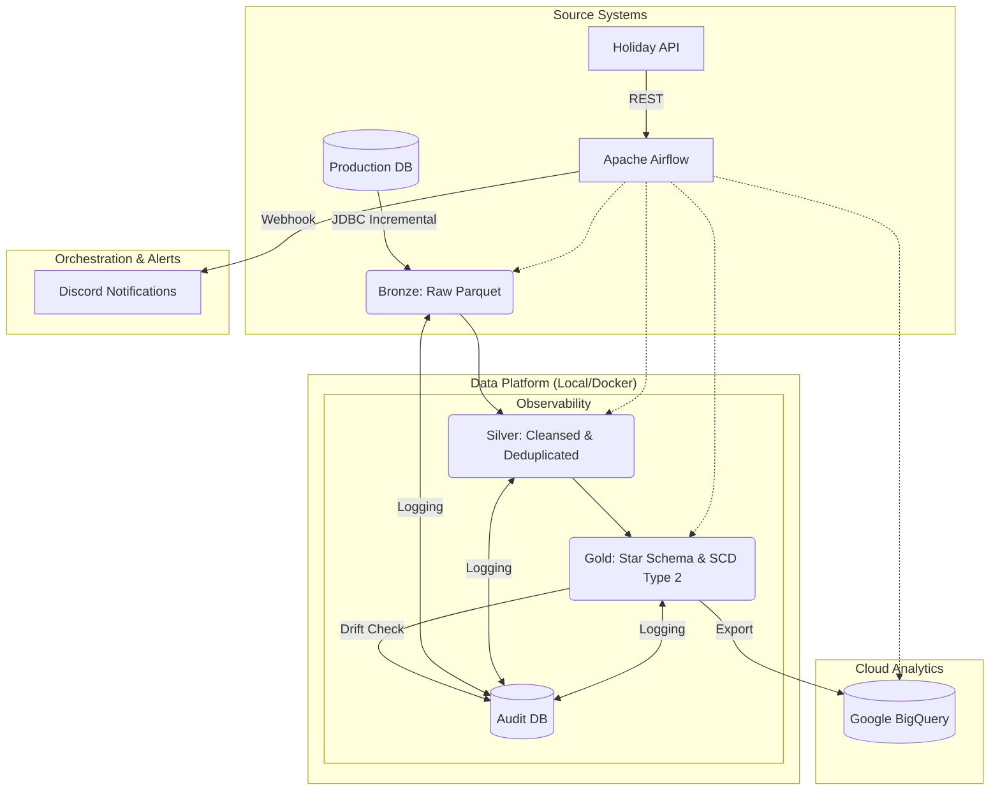

# 🚀 E-commerce Medallion Data Platform

Welcome to the **Medallion Architect Challenge Project**! This project implements a production-grade **Medallion Architecture** using PySpark, Airflow, and MinIO. It transforms the [Brazilian E-commerce Public Dataset by Olist](https://www.kaggle.com/datasets/olistbr/brazilian-ecommerce) into a high-performance, analytics-ready Data Platform with **Hybrid Cloud** capabilities.

---

## 🏗️ Architecture Overview

The pipeline implements an end-to-end flow with rigorous observability and data quality checks:



---

### 🛰️ The Three Layers:
1.  **🥉 Bronze (Raw)**: Captures the original data from source files "as-is" into MinIO.
2.  **🥈 Silver (Cleansed)**: Deduplication, null handling, data typing, and schema validation.
3.  **🥇 Gold (Curated)**: Business-level aggregates, Star Schema (Facts & Dimensions), and Feature Tables for ML.

---

## 📊 Data Schema

The project implements a Star Schema in the Gold layer, optimized for analytical queries.


*Note: The schema includes core dimensions (Customers, Products, Sellers, Location, Date) and a central Fact table (Orders), along with specialized Feature tables for behavioral analysis.*

---

### 🛰️ Core Features

1.  **Observability & Governance**:
    *   **Audit Logging**: Every pipeline run is logged to a PostgreSQL `audit.run_logs` table (timing, row counts, status).
    *   **Data Quality (DQ)**: Automated checks for PK uniqueness, null values, and **Row-Count Drift Detection**.
    *   **Alerting**: Real-time Discord notifications for pipeline success and failures.
2.  **Advanced Data Modeling**:
    *   **SCD Type 2**: History tracking for Customers, Products, and Sellers.
    *   **Star Schema**: Optimization for BI tool performance.
    *   **Feature Engineering**: Pre-computed RFM (Recency, Frequency, Monetary) tables.
3.  **Real-World Reliability**:
    *   **Incremental Loading (CDC)**: Watermark-based ingestion fetching only new/updated records.
    *   **Idempotency**: All jobs are designed to be safe for re-execution.
    *   **Parallel Execution**: Multi-threaded Spark jobs for maximized throughput.

---

## 🛠️ Tech Stack

-   **Processing**: [Apache Spark 4.0](https://spark.apache.org/) (PySpark)
-   **Orchestration**: [Apache Airflow](https://airflow.apache.org/)
-   **Storage**: [MinIO](https://min.io/) (S3-compatible) & [Google BigQuery](https://cloud.google.com/bigquery)
-   **Audit/Metadata**: [PostgreSQL 17](https://www.postgresql.org/)
-   **Infrastructure**: [Docker](https://www.docker.com/) & Docker Compose
-   **Alerts**: Discord Webhooks

---

## 📂 Project Structure

```text
.
├── airflow/                # Airflow configuration & DAGs
│   ├── dags/               # medallion_pipeline.py (The main DAG)
│   └── Dockerfile          # Custom Airflow image with Spark support
├── spark/                  # Spark Jobs & Configuration
│   ├── jobs/               # bronze, silver, and gold scripts
│   ├── extra_jars/         # JDBC & S3 Connectors
│   └── config.py           # Centralized configuration & DQ logic
├── warehouse/              # SQL Initialization & Analytics
│   ├── init_multiple_dbs.sql # Multi-DB setup (Audit)
│   └── visualization_queries.sql # Performance & RFM queries
├── raw/                    # Kaggle source datasets 
├── docker-compose.yaml     # Full stack orchestration
└── README.md               # You are here!
```

---

## 🚀 Getting Started

### 1. Prerequisites
- [Docker Desktop](https://www.docker.com/products/docker-desktop/) with at least 4GB of RAM allocated.
- A **GCP Service Account Key** (`application_default_credentials.json`) for BigQuery export.

### 2. Download Spark Connectors
Since the Spark JARs are excluded via `.gitignore`, you must download them manually and place them in the `spark/extra_jars/` directory:

| JAR File | Version | Download Link |
| :--- | :--- | :--- |
| **PostgreSQL JDBC** | 42.7.4 | [Download](https://repo1.maven.org/maven2/org/postgresql/postgresql/42.7.4/postgresql-42.7.4.jar) |
| **Hadoop AWS** | 3.4.1 | [Download](https://repo1.maven.org/maven2/org/apache/hadoop/hadoop-aws/3.4.1/hadoop-aws-3.4.1.jar) |
| **AWS SDK Bundle** | 2.23.19 | [Download](https://repo1.maven.org/maven2/software/amazon/awssdk/bundle/2.23.19/bundle-2.23.19.jar) |

### 3. Launch the Infrastructure
```bash
docker-compose up -d
```

### 4. Access the Dashboards

| Service | URL | User | Password |
| :--- | :--- | :--- | :--- |
| **Airflow UI** | [http://localhost:8088](http://localhost:8088) | `admin` | `admin` |
| **MinIO Console** | [http://localhost:9001](http://localhost:9001) | `admin` | `password` |
| **Spark Master** | [http://localhost:8080](http://localhost:8080) | - | - |

---

## 🔄 Pipeline Execution

Trigger the `medallion_pipeline` DAG in Airflow. The sequence is:
1.  **`fetch_holidays`**: Pulls external API data for `dim_date`.
2.  **`bronze_ingestion`**: Incremental JDBC fetch from Source DB.
3.  **`silver_processing`**: Deduplication and schema enforcement.
4.  **`gold_modeling`**: Builds the Fact/Dimension/Feature tables (SCD2).
5.  **`export_to_bigquery`**: Syncs the Gold layer to the Cloud.

---

## ⚠️ Common Warnings & Troubleshooting

You may notice several warnings in the Spark logs. Most of these are expected in a containerized S3 environment:

-   **`jdk.incubator.vector`**: Spark 4.0 uses modern JVM optimizations. Safe to ignore.
-   **`NativeCodeLoader`**: Spark falls back to Java-native compression if C++ libraries aren't found in the container. No impact on correctness.
-   **`S3ABlockOutputStream (Syncable API)`**: S3 is an object store. Gracefully handled via `downgrade.syncable.exceptions`.

---
*Architected for the Medallion Challenge Data Platform.*
