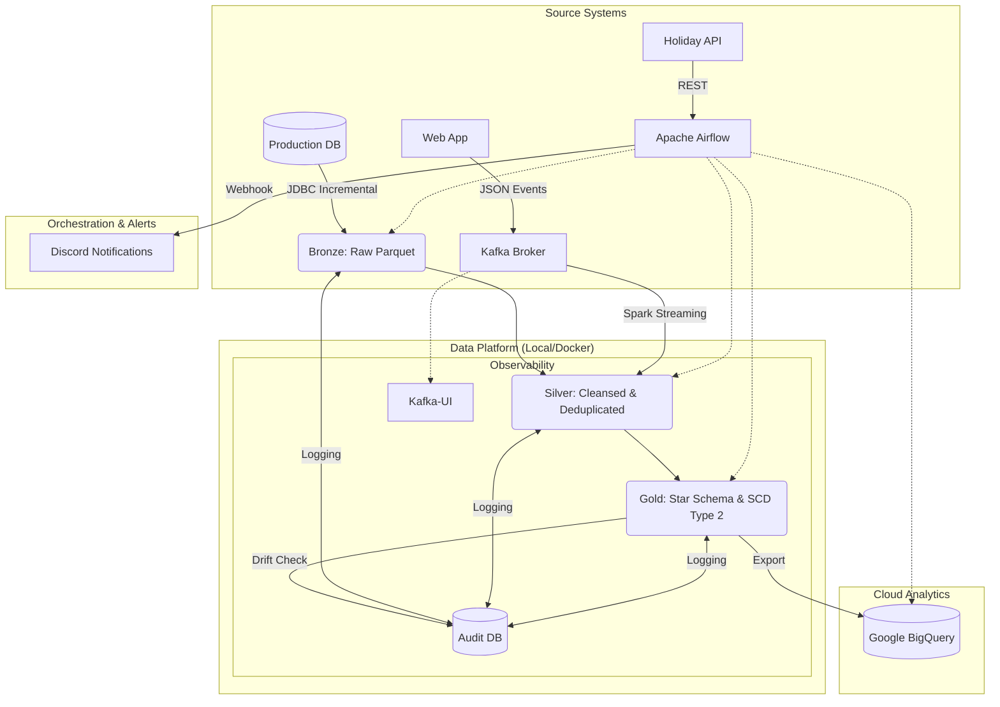

# 🚀 E-commerce Medallion Data Platform

Welcome to the **Medallion Architect Challenge Project**! This project implements a production-grade **Medallion Architecture** using PySpark, Airflow, and MinIO. It transforms the [Brazilian E-commerce Public Dataset by Olist](https://www.kaggle.com/datasets/olistbr/brazilian-ecommerce) into a high-performance, analytics-ready Data Platform with **Hybrid Cloud** capabilities.

---

## 🏗️ Architecture Overview

The pipeline implements an end-to-end flow with rigorous observability and data quality checks:



---

### 🛰️ The Three Layers:
1.  **🥉 Bronze (Raw)**: Captures the original data from source files "as-is" into MinIO.
2.  **🥈 Silver (Cleansed)**: Deduplication, null handling, precision data typing, and **Final-State Schema Enforcement**.
3.  **🥇 Gold (Curated)**: Business-level aggregates, Star Schema (Facts & Dimensions), and Feature Tables with **Modeled Schema Validation**.

---

## 📊 Data Schema

The project implements a Star Schema in the Gold layer, optimized for analytical queries.


*Note: The schema includes core dimensions (Customers, Products, Sellers, Location, Date) and a central Fact table (Orders), along with specialized Feature tables for behavioral analysis.*

---

### 🛰️ Core Features

1.  **Observability & Governance**:
    *   **Audit Logging**: Every pipeline run is logged to a PostgreSQL `audit.run_logs` table (timing, row counts, status).
    *   **Data Quality (DQ)**: Automated **Multi-Layered Schema Validation** (Bronze, Silver, Gold), PK uniqueness checks, null value monitoring, and **Row-Count Drift Detection**.
    *   **Alerting**: Real-time Discord notifications for pipeline success and failures.
2.  **Advanced Data Modeling**:
    *   **SCD Type 2**: History tracking for Customers, Products, and Sellers.
    *   **Point-in-Time Join Logic**: Fact tables use range joins to link to the corresponding version of historical dimensions.
    *   **Star Schema**: Optimization for BI tool performance.
    *   **Feature Engineering**: Pre-computed RFM (Recency, Frequency, Monetary) tables.
3.  **Real-World Reliability**:
    *   **Incremental Loading (CDC)**: Watermark-based ingestion fetching only new/updated records to minimize I/O and compute overhead.
        *   **Architectural Trade-off**: This pipeline prioritizes performance and scalability by avoiding "Full Scan" hard-delete detection. In a production environment, hard-deletes are typically propagated via **Log-Based CDC** (e.g., Debezium) or **Soft Deletes** (`is_deleted` flags) to ensure the Medallion layers stay synchronized without the O(N) cost of full-table comparisons.
    *   **Idempotency**: All jobs are designed to be safe for re-execution.
    *   **Parallel Execution**: Multi-threaded Spark jobs for maximized throughput.
4.  **Real-Time Streaming Layer (Lambda Architecture)**:
    *   **Kafka-based Ingestion**: Real-time events (e.g., Product Reviews) streamed via Kafka with a custom **Self-Managing Lifecycle**.
    *   **Coordinated Shutdown**: Uses a signal-file mechanism (`stop_simulation.signal`) to synchronize the Python Producer and Spark Consumer, ensuring the consumer only stops once the simulation is complete.
    *   **Fault-Tolerant Monitoring**: Implements a **Patience Timeout** logic that prevents the streaming consumer from hanging if records are missed (e.g., when using `latest` offsets).
    *   **Structured Streaming**: Spark-native streaming job that cleanses and merges live events into the Silver tier with full audit logging support.
    *   **Unified Analytical View**: The Gold layer automatically unions historical batch data with real-time streams for up-to-the-minute analysis.

---

## 🔍 Architectural Deep Dives

For a detailed technical walkthrough of each phase (ideal for interview preparation), explore the following documentation:

| Phase | Focus Area | Detailed Documentation |
| :--- | :--- | :--- |
| **Phase 1** | **Source & Governance** | [Source Simulation & Audit Logic](docs/01_source_audit.md) |
| **Phase 2** | **Bronze Ingestion** | [Incremental Watermarking & Parallelism](docs/02_bronze_ingestion.md) |
| **Phase 3** | **Silver Transformation** | [Precision Tuning & CDC Upserts](docs/03_silver_transformation.md) |
| **Phase 4** | **Gold Modeling** | [Star Schema & SCD Type 2](docs/04_gold_modeling.md) |
| **Phase 5** | **Streaming Lambda** | [Real-Time Lifecycle & Coordination](docs/05_streaming_lambda.md) |
| **Phase 6** | **Cloud & Observability** | [BigQuery Sync & Discord Alerting](docs/06_observability_cloud.md) |

---

## 🛠️ Tech Stack

-   **Processing**: [Apache Spark 4.0](https://spark.apache.org/) (PySpark)
-   **Orchestration**: [Apache Airflow](https://airflow.apache.org/)
-   **Storage**: [MinIO](https://min.io/) (S3-compatible) & [Google BigQuery](https://cloud.google.com/bigquery)
-   **Audit/Metadata**: [PostgreSQL 17](https://www.postgresql.org/)
-   **Infrastructure**: [Docker](https://www.docker.com/) & Docker Compose
-   **Alerts**: Discord Webhooks

---

## 📂 Project Structure

```text
.
├── airflow/                # Airflow configuration & DAGs
│   ├── dags/               # medallion_pipeline.py (The main DAG)
│   └── Dockerfile          # Custom Airflow image with Spark support
├── spark/                  # Spark Jobs & Configuration
│   ├── jobs/               # bronze, silver, and gold scripts
│   ├── extra_jars/         # JDBC & S3 Connectors
│   └── config.py           # Centralized configuration & DQ logic
├── warehouse/              # SQL Initialization & Analytics
│   ├── init_multiple_dbs.sql # Multi-DB setup (Audit)
│   └── visualization_queries.sql # Performance & RFM queries
├── raw/                    # Kaggle source datasets 
├── docker-compose.yaml     # Full stack orchestration
└── README.md               # You are here!
```

---

## 🚀 Getting Started

### 1. Prerequisites
- [Docker Desktop](https://www.docker.com/products/docker-desktop/) with at least 4GB of RAM allocated.
- A **GCP Service Account Key** (`application_default_credentials.json`) for BigQuery export.

### 2. Download Spark Connectors
Since the Spark JARs are excluded via `.gitignore`, you must download them manually and place them in the `spark/extra_jars/` directory:

| JAR File | Version | Download Link |
| :--- | :--- | :--- |
| **PostgreSQL JDBC** | 42.7.4 | [Download](https://repo1.maven.org/maven2/org/postgresql/postgresql/42.7.4/postgresql-42.7.4.jar) |
| **Hadoop AWS** | 3.4.1 | [Download](https://repo1.maven.org/maven2/org/apache/hadoop/hadoop-aws/3.4.1/hadoop-aws-3.4.1.jar) |
| **AWS SDK Bundle** | 2.23.19 | [Download](https://repo1.maven.org/maven2/software/amazon/awssdk/bundle/2.23.19/bundle-2.23.19.jar) |
| **Spark-SQL Kafka** | 4.0.2 | [Download](https://repo1.maven.org/maven2/org/apache/spark/spark-sql-kafka-0-10_2.13/4.0.2/spark-sql-kafka-0-10_2.13-4.0.2.jar) |
| **Kafka Clients** | 3.9.0 | [Download](https://repo1.maven.org/maven2/org/apache/kafka/kafka-clients/3.9.0/kafka-clients-3.9.0.jar) |
| **Spark Token Kafka** | 4.0.2 | [Download](https://repo1.maven.org/maven2/org/apache/spark/spark-token-provider-kafka-0-10_2.13/4.0.2/spark-token-provider-kafka-0-10_2.13-4.0.2.jar) |
| **Commons Pool 2** | 2.12.0 | [Download](https://repo1.maven.org/maven2/org/apache/commons/commons-pool2/2.12.0/commons-pool2-2.12.0.jar) |

### 3. Launch the Infrastructure
```bash
docker-compose up -d
```

### 4. Access the Dashboards

| Service | URL | User | Password |
| :--- | :--- | :--- | :--- |
| **Airflow UI** | [http://localhost:8088](http://localhost:8088) | `admin` | `admin` |
| **MinIO Console** | [http://localhost:9001](http://localhost:9001) | `admin` | `password` |
| **Spark Master** | [http://localhost:8080](http://localhost:8080) | - | - |
| **Kafka UI** | [http://localhost:8090](http://localhost:8090) | - | - |

---

## 🔄 Pipeline Execution & Workflow

The pipeline is designed to simulate a real-world enterprise environment where data originates from a production database and flows into a hybrid cloud analytical platform.

### 1. Preliminary Setup (Source Simulation)
Before running the main pipeline, you must simulate the production environment:
1.  Locate the DAG **`setup_source_db`** in the Airflow UI.
2.  Trigger it to run `seed_source.py`. This script:
    *   Creates the `olist` schema in the source PostgreSQL container.
    *   Seeds it with raw Kaggle data.
    *   Adds `updated_at` watermarks to enable CDC (Change Data Capture) simulation.

### 2. Main Medallion Pipeline
Once the source is seeded, trigger the **`medallion_pipeline`** DAG. The sequence is:
1.  **`fetch_holidays`**: Pulls external API data for `dim_date` enrichment.
2.  **`bronze_ingestion`**: Performs incremental JDBC fetching from the Source DB using watermarks.
3.  **`silver_processing`**: Executes deduplication, precision casting, and **Final-State Silver Schema Enforcement**.
4.  **`gold_modeling`**: Builds the Fact/Dimension/Feature tables with **SCD Type 2** logic and **Star-Schema Structural Validation**.
5.  **`export_to_bigquery`**: Synchronizes the final Gold layer to **Google BigQuery**.

### 3. Real-Time Stream Ingestion (Lambda Simulation)
The platform features a real-time review stream that can run concurrently with the batch pipeline or as a standalone simulation.
1.  Locate the DAG **`streaming_pipeline`** in the Airflow UI.
2.  Trigger it. The workflow includes:
    *   **`reset_streaming_data`**: Wipes previous simulation state in MinIO and S3 checkpoints.
    *   **`init_kafka_topic`**: Ensures the `olist_reviews_stream` topic exists.
    *   **`review_consumer_task`**: Launches the **Structured Streaming** consumer (`kafka_consumer_reviews.py`) which ingests Kafka events into the Silver tier.
    *   **`review_producer_task`**: Executes the **Producer Simulation** (`kafka_producer_reviews.py`) sending a batch of Olist reviews to Kafka.
3.  **Graceful Shutdown**: The consumer automatically detects when the producer is finished via a signal file and shuts itself down once the target row count is met.

---

## 📈 Impact & Key Results

This project focuses on measurable "Senior-level" KPIs across performance, cost, and reliability:

| Metric Category | Key Result | Technical Impact |
| :--- | :--- | :--- |
| **Pipeline Performance** | **22% Runtime Reduction** | End-to-end duration dropped from 04:27 to 03:28 via incremental loading and multi-threading. |
| **Data Throughput** | **~300% Concurrency Gain** | Used `ThreadPoolExecutor` to process 8+ tables in parallel stages instead of sequential loops. |
| **Cloud Cost Savings** | **~80% Optimization** | Reduced BigQuery storage fees by keeping Bronze/Silver layers in on-prem MinIO (S3) storage. |
| **Storage Efficiency** | **10x Compression** | Achieved significant footprint reduction via Parquet format and precise schema typing (Short/Decimal). |
| **Data Integrity** | **Zero Structural Drift** | Implemented **Fail-Fast Schema Validation** at every layer (Bronze/Silver/Gold) to prevent corrupted data propagation. |
| **Observability** | **<5s Detection (MTTD)** | Automated industry-standard alerting via Discord webhooks and row-count drift detection. |

---

## ⚠️ Common Warnings & Troubleshooting

You may notice several warnings in the Spark logs. Most of these are expected in a containerized S3 environment:

-   **`jdk.incubator.vector`**: Spark 4.0 uses modern JVM optimizations. Safe to ignore.
-   **`NativeCodeLoader`**: Spark falls back to Java-native compression if C++ libraries aren't found in the container. No impact on correctness.
-   **`S3ABlockOutputStream (Syncable API)`**: S3 is an object store. Gracefully handled via `downgrade.syncable.exceptions`.

---
*Architected for the Medallion Challenge Data Platform.*
