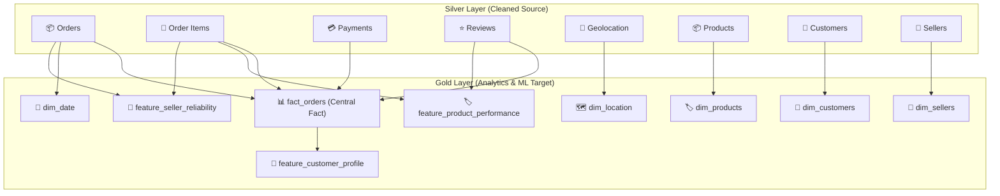

# Gold Layer Documentation: Technical Specifications & Logic

This document provides a comprehensive technical reference for the Gold layer in the Medallion pipeline. It details the schema, transformation logic, and data quality rules (null handling) for every table.

---

## 1. Visual Data Flow

The Gold layer transforms **Cleaned (Silver)** data into structured tables for business intelligence and machine learning.

---

## 2. Star Schema: Fact Table

### Table: `fact_orders`
Stores business transactions. It joins order headers with aggregated items, payments, and reviews. 

**Transformation Logic:**
1.  **Left Join:** `orders` is left-joined with aggregated metrics to ensure all orders are retained.
2.  **Cast & Fill:** All metric columns are cast to appropriate types and guaranteed non-null via `fillna`.

| Column | Type | Description | Source / Logic | Null-Handling |
| :--- | :--- | :--- | :--- | :--- |
| `order_id` | String | PK | `orders.order_id` | Required |
| `customer_id` | String | FK | `orders.customer_id` | Required |
| `order_status` | String | Status | `orders.order_status` | Required |
| `total_price` | Float | Value | `sum(order_items.price)` | `0.0` |
| `total_freight` | Float | Cost | `sum(order_items.freight_value)` | `0.0` |
| `total_items` | Int | Quantity | `count(order_items.order_item_id)` | `0` |
| `unique_products` | Int | Diversity | `countDistinct(product_id)` | `0` |
| `unique_sellers` | Int | Diversity | `countDistinct(seller_id)` | `0` |
| `total_payment_value` | Float | Amount | `sum(order_payments.payment_value)`| `0.0` |
| `max_installments` | Int | Finance | `max(payment_installments)` | `0` |
| `payment_count` | Int | Volume | `count(payment_sequential)` | `0` |
| `avg_review_score` | Float | Quality | `avg(order_reviews.review_score)` | `0.0` |
| `review_count` | Int | Feedback | `count(order_reviews.review_id)` | `0` |

---

## 3. Star Schema: Dimension Tables

### Table: `dim_customers`
Unique customer information and geography.

| Column | Type | Description |
| :--- | :--- | :--- |
| `customer_id` | String | Surrogate key for the customer (per order). |
| `customer_unique_id` | String | Unique identifier for the customer across all orders. |
| `customer_zip_code_prefix`| String | Customer's zip code (first 5 digits). |
| `customer_city` | String | City of the customer. |
| `customer_state` | String | State of the customer. |

### Table: `dim_products`
Product catalog and physical metadata.
- **Note:** Filtered in Silver to ensure physical dimensions exist.

| Column | Type | Description |
| :--- | :--- | :--- |
| `product_id` | String | Primary Key for the product. |
| `product_category_name` | String | Category name in Portuguese. |
| `product_category_name_english`| String | Category name translated to English. |
| `product_name_lenght` | Int | Character count of the product name. |
| `product_description_lenght`| Int | Character count of the product description. |
| `product_photos_qty` | Int | Number of product photos. |
| `product_weight_g` | Float | Product weight in grams. |
| `product_length_cm` | Float | Product length in centimeters. |
| `product_height_cm` | Float | Product height in centimeters. |
| `product_width_cm` | Float | Product width in centimeters. |

### Table: `dim_sellers`
Seller details and location.

| Column | Type | Description |
| :--- | :--- | :--- |
| `seller_id` | String | Primary Key for the seller. |
| `seller_zip_code_prefix`| String | Seller's zip code (first 5 digits). |
| `seller_city` | String | City of the seller. |
| `seller_state` | String | State of the seller. |

### Table: `dim_date`
Extracted from `order_purchase_timestamp` for easy time-series analysis.

| Column | Type | Description |
| :--- | :--- | :--- |
| `date_key` | Timestamp | Primary Key (Full timestamp). |
| `year` | Int | Year part. |
| `month` | Int | Month part (1-12). |
| `day` | Int | Day of month. |
| `hour` | Int | Hour of day (0-23). |
| `day_of_week` | Int | Numeric day of week (1=Sunday). |
| `weekday_name` | String | Name of the day (e.g., "Monday"). |

### Table: `dim_location`
Geospatial reference table.

| Column | Type | Description |
| :--- | :--- | :--- |
| `geolocation_zip_code_prefix`| String | Zip code prefix (Join key). |
| `geolocation_lat` | Float | Latitude coordinate. |
| `geolocation_lng` | Float | Longitude coordinate. |
| `geolocation_city` | String | City name. |
| `geolocation_state` | String | State code. |

---

## 4. ML Feature Tables

Optimized for machine learning experiments. These tables explicitly handle nulls to prevent model training failures.

### Table: `feature_customer_profile`
Customer behavior and RFM metrics.
- **Recency Logic:** Days between the dataset's `max_date` and the customer's `last_purchase`.

| Column | Description | Null-Handling Logic |
| :--- | :--- | :--- |
| `customer_id` | PK | Required |
| `frequency` | Total Orders | `0` (natural count) |
| `monetary` | Lifetime Spend | `Fill: 0.0` |
| `avg_satisfaction`| Average review | `Fill: 3.0` (Neutral score for no-history) |
| `recency` | Days since purchase| Calculated from `last_purchase` |

### Table: `feature_product_performance`
Product sales and quality performance.

| Column | Description | Null-Handling Logic |
| :--- | :--- | :--- |
| `product_id` | PK | Required |
| `total_sales` | Unit Volume | `0` |
| `total_revenue` | Total Amount | `0.0` |
| `avg_rating` | Product Rating | `Fill: 3.0` (Neutral score for no-reviews) |

### Table: `feature_seller_reliability`
Logistics and fulfillment performance per seller.

| Column | Description | Null-Handling Logic |
| :--- | :--- | :--- |
| `seller_id` | PK | Required |
| `total_orders` | Managed volume | `0` |
| `total_sales_value`| Managed amount | `0.0` |
| `avg_delivery_time_days`| Speed | `Fill: -1.0` (indicates unknown/undelivered) |

---

## 5. Global Data Integrity Rules

| Rule Category | Applied Logic |
| :--- | :--- |
| **Fact Metrics** | All numeric metrics in `fact_orders` are coalesced to `0` or `0.0`. |
| **Dim Keys** | Primary and Foreign keys are validated for non-null status. |
| **ML Models** | Features like `avg_satisfaction` use `3.0` (neutral) instead of `0.0` to avoid biasing models toward "failure" when reviews are simply missing. |
| **Delivery Time** | Null delivery times are mapped to `-1.0` to distinguish between "Fast delivery" (small number) and "Data missing/In process". |
